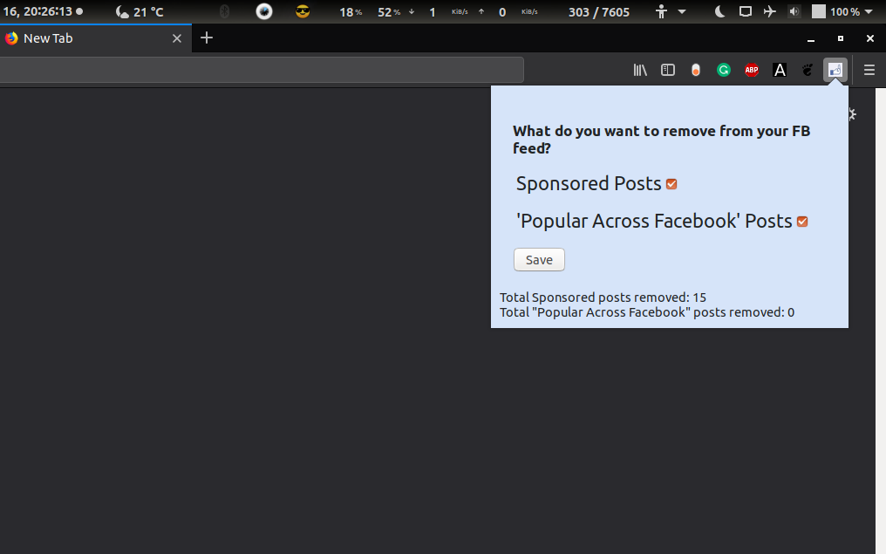

# Facebook with less shit

A web extention to remove "Sponsored" and "Popular Across Facebook" posts from the Facebook feed.

Available for Chrome [here](https://chrome.google.com/webstore/detail/facebook-with-less-shit/hiohbfomcpigkglfdipbpnigleemklfg) and for Firefox [here](https://addons.mozilla.org/en-US/firefox/addon/facebook-with-less-shit/)

### Load the extension locally on your computer

You can load this extension locally without having to download it from the extension website. The way you do this depends on which browser you are using.

#### Chrome

* Download this source code by clicking on `Clone or Download` then `Download ZIP`, extract it, rename `chrome_manifest.json` as `manifest.json`
* Visit `chrome://extensions/` in your Chrome browser.
* Click Load Unpacked.
* Select the downloaded extension’s folder.

#### Firefox

* Download this source code by clicking on `Clone or Download` then `Download ZIP`, extract it, rename `firefox_manifest.json` as `manifest.json`
* Visit `about:debugging` in your Firefox browser.
* Click on Load Temporary Add-on.
* Select the manifest.json within the downloaded extension’s folder.
